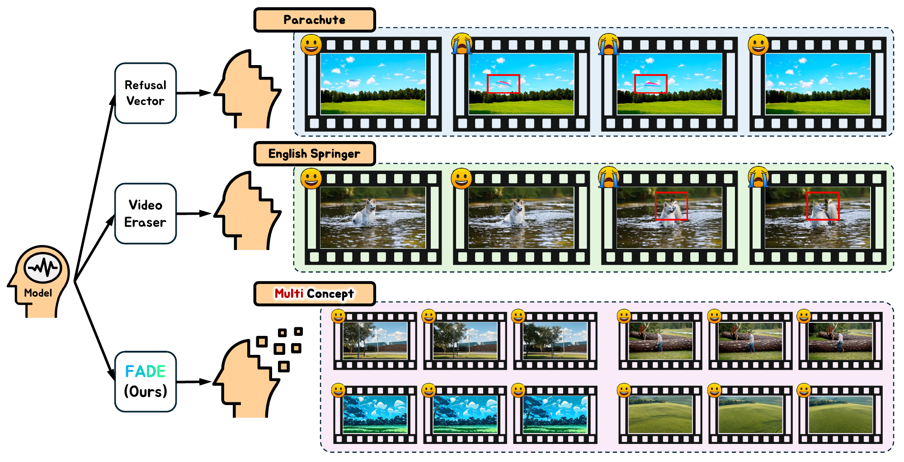
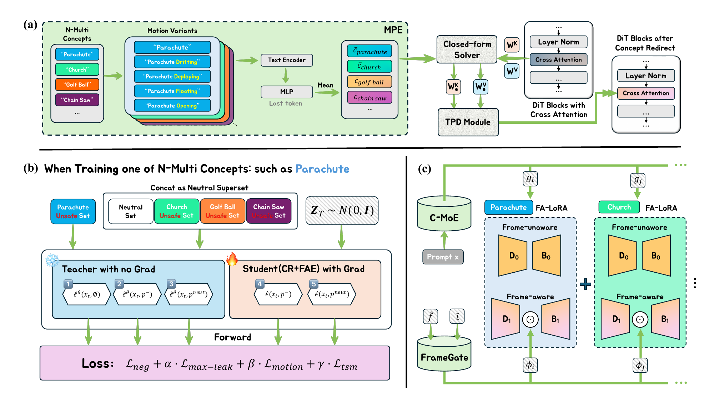
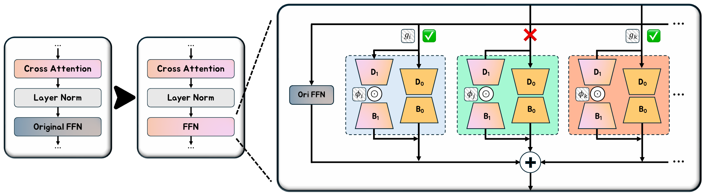
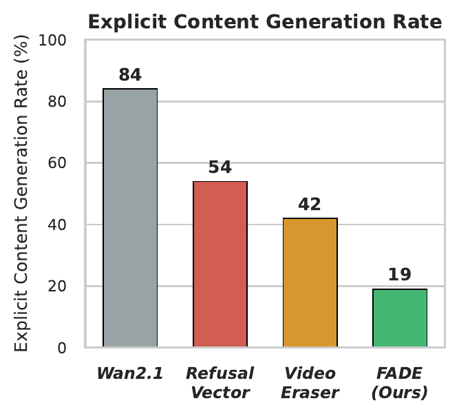
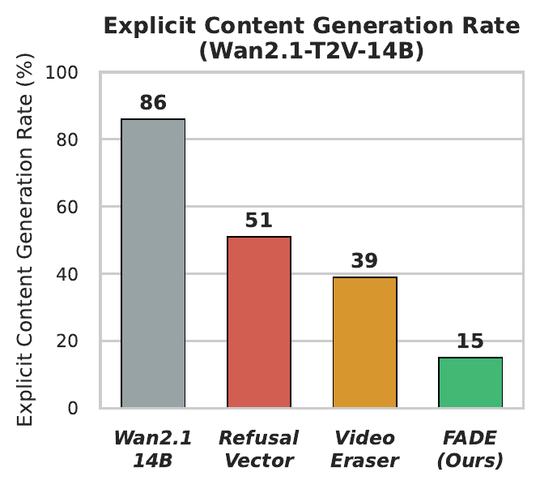
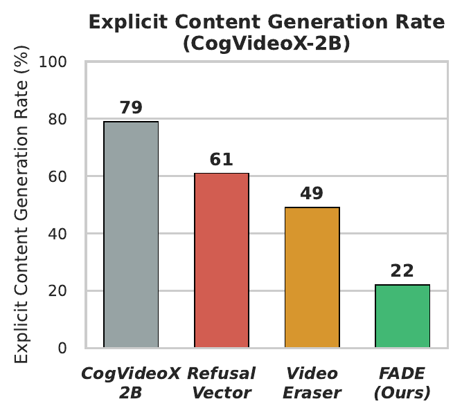
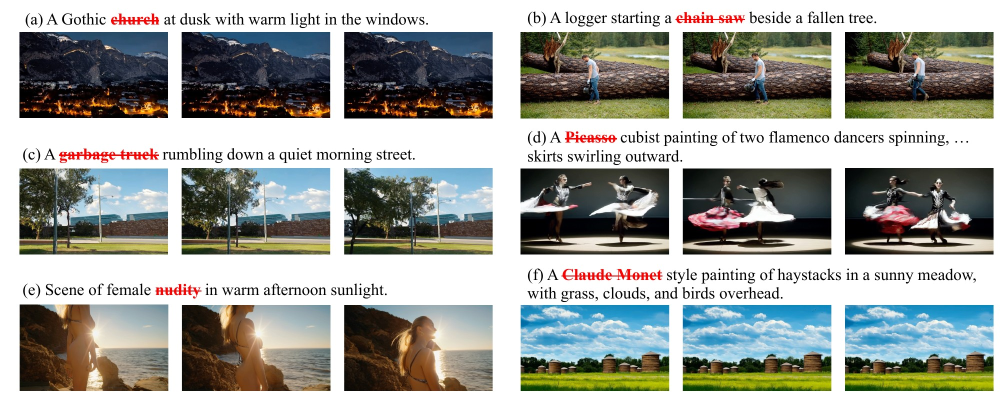
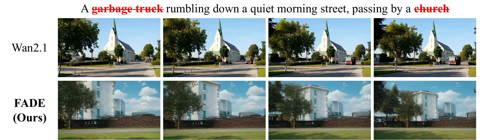

<div align="center">

# FADE: Frame-Aware Diffusion-Transformer-based Multi-Concept Erasure for Video Unlearning

**Yuchen Li**<sup>1</sup> · **Kaiyuan Deng**<sup>2</sup> · **Chaoran Feng**<sup>1</sup> · **Zhenyu Tang**<sup>1</sup> · **Xiaolong Ma**<sup>2,†</sup> · **Li Yuan**<sup>1,†</sup>

<sup>1</sup>Peking University &nbsp;&nbsp; <sup>2</sup>University of Arizona &nbsp;&nbsp; <sup>†</sup>Corresponding authors

[](paper/FADE.pdf)
[](https://github.com/Wan-Video/Wan2.1)
[](LICENSE)

</div>

<p align="center">
  
</p>

<p align="center"><em>
Prior T2V erasure methods apply the same suppression to every frame, so an erased concept can resurface mid-clip
(red boxes; top: Refusal Vector on <b>parachute</b>, middle: VideoEraser on <b>English springer</b>).
FADE erases several concepts from a single backbone and keeps them suppressed across frames (bottom).
</em></p>

---

## 🔥 Highlights

- **Frame-reactivation gap.** We formalize a failure that clip-level metrics hide: a concept that is suppressed in most frames can reappear in a few. The gap is the difference between peak-frame and clip-mean concept presence.
- **Multi-concept video unlearning.** To our knowledge, FADE is the first framework that erases **many concepts from one text-to-video model**. It does so with a joint closed-form edit, per-concept frame-aware adapters, and similarity-based composition at inference.
- **Strong erasure, small fidelity cost.** With **16 concepts** (10 objects, 5 artistic styles, nudity) erased from one Wan2.1-T2V-1.3B model:
  - Residual object accuracy drops to **4.9%**, against **15.5%** for the strongest of eight baselines.
  - The VBench average stays **within 0.9%** of the unedited model.
- **Holds across settings.** FADE keeps its lead over the strongest baseline in each of these settings:
  - VLM and blinded human judges
  - compositional prompts
  - **30** simultaneously erased celebrity identities
  - violence and hate content
  - four jailbreak suites
  - **four backbones from three model families** (Wan2.1-1.3B/14B, CogVideoX-2B, HunyuanVideo-1.5)

## 📖 Abstract

Text-to-video (T2V) diffusion models can reproduce copyrighted, violent, or explicit content. This motivates concept erasure: removing designated concepts from a pretrained model while preserving its behavior on everything else.

Existing T2V erasure methods leave two problems open:
- **Frame-agnostic suppression.** It can leave isolated frames in which an erased concept resurfaces, a *frame-reactivation gap* that clip-level averages obscure.
- **One target at a time.** These methods are usually evaluated with a single target concept or category.

We propose **FADE**, a multi-concept video unlearning framework that works in three steps:
1. A joint closed-form key/value edit suppresses all target concepts.
2. Per-concept frame-aware low-rank adapters remove residual per-frame leakage. Their strength is gated by the frame index and the denoising timestep. Each adapter is trained with the other targets' prompts as hard negatives, which keeps the concept-specific components of different adapters well separated.
3. A similarity-based soft router combines the adapters according to the prompt.

## 🧩 Method

<p align="center">
  
</p>

<p align="center"><em>
(a) Concept Redirect: motion-paraphrased concept embeddings enter a joint closed-form K/V solve, and Texture-Phase Decay blends the edited and original projections over timesteps.
(b) FAE training for one concept: the unsafe prompts of every other erased concept join the neutral set as hard negatives; a frozen CR teacher supplies the targets.
(c) At inference, FrameGate modulates the frame-aware branch of each FA-LoRA and the C-MoE router scales each expert by its prompt gate.
</em></p>

FADE has three components:

| Component | What it does | Code |
|---|---|---|
| **Concept Redirect (CR)** | A UCE-style **joint closed-form edit** of the cross-attention K/V projections for all target concepts, solved once in about one minute. It adds two video-specific changes: a **Motion-Paraphrase Embedding** (each concept is averaged with motion variants such as "parachute drifting") and a **Texture-Phase Decay** (the edit strength is reduced during the texture-refinement timesteps to avoid over-sharpening). | `cr_edit.py` |
| **Frame-Aware Erasure (FAE)** | A per-concept **FA-LoRA** on the first FFN linear of every block. It has a static branch plus a frame-aware branch gated by **FrameGate**, a 290-parameter MLP on (frame index, timestep). It is trained with negative guidance, a **peak-frame leakage** loss on the worst frames, a **neutral-anchor** loss that uses the other concepts' prompts as hard negatives, and a **flicker** penalty. | `train_fae.py`, `wan/modules/` |
| **C-MoE routing** | A **token-level max-similarity** gate computed once per prompt. It activates the experts whose concepts the prompt mentions and adds them in the FFN path; a clean prompt usually sees the CR-edited backbone alone. | `wan/modules/lora_router.py`, `tools/calibrate_router.py`, `tools/inference.py` |

<details>
<summary><b>FA-LoRA attached to a DiT FFN (click to expand)</b></summary>
<p align="center"></p>
</details>

## 📊 Results

All numbers are from the paper. *acc* is the clip-mean per-frame concept presence (%, lower is better).

### Object erasure: 9 Imagenette classes erased from one Wan2.1-1.3B model

| Method | Avg acc ↓ | FVD ↓ |
|---|:---:|:---:|
| Wan2.1 (unedited) | 77.8 | 147.3 |
| UCE (T2I, ported) | 71.6 | 181.2 |
| ESD-x (T2I, ported) | 66.4 | 220.7 |
| ESD-u (T2I, ported) | 63.5 | 253.9 |
| MACE (T2I, ported) | 54.0 | 210.1 |
| SAFREE | 52.6 | 213.1 |
| T2VUnlearning | 65.7 | 215.8 |
| Refusal Vector | 60.1 | 184.9 |
| VideoEraser | 15.5 | 203.4 |
| **FADE (ours)** | **4.9** | **158.8** |

The ranking is unchanged under a VLM judge (Qwen3.6-27B) and in a blinded human study: FADE scores 4.8 (VLM) and 5 (human), against 14.7 and 15 for VideoEraser.

### Video fidelity (VBench, neutral MSR-VTT prompts, higher is better)

| Method | SC | MS | AQ | IQ | TF | Avg |
|---|:---:|:---:|:---:|:---:|:---:|:---:|
| Wan2.1 (unedited) | 96.38 | 98.49 | 64.30 | 67.20 | 98.50 | 84.97 |
| Refusal Vector | 91.74 | 93.28 | 58.46 | 62.83 | 93.15 | 79.89 |
| VideoEraser | 93.52 | 95.67 | 61.38 | 64.54 | 95.86 | 82.19 |
| **FADE (ours)** | **95.82** | **97.93** | **63.41** | **66.28** | **97.64** | **84.22** |

### Unsafe content, identities, and artistic styles

| Method | Nudity ↓ | Violence ↓ | Hate ↓ | 30-celeb Acc<sub>e</sub> ↓ | 30-celeb Acc<sub>s</sub> ↑ | Style sim. (avg) ↓ |
|---|:---:|:---:|:---:|:---:|:---:|:---:|
| Wan2.1 (unedited) | 84 | 68 | 73 | 88.6 | 90.8 | 90.6 |
| Refusal Vector | 54 | 46 | 47 | 60.3 | 71.2 | 81.2 |
| VideoEraser | 42 | 35 | 38 | 19.8 | 74.5 | 74.6 |
| **FADE (ours)** | **19** | **16** | **17** | **6.4** | **86.1** | **35.4** |

The unsafe-content columns give the percentage of frames flagged by NudeNet (nudity) or Q16 (violence, hate). The celebrity columns give the GIPHY Celebrity Detector accuracy on 30 erased identities (Acc<sub>e</sub>) and 10 retained identities (Acc<sub>s</sub>).

### Multi-concept composition and scaling

On prompts that mention **two erased concepts at once**, FADE leaves **4.0** average residual accuracy, against 12.9 for VideoEraser and 47–57 for the other baselines.

Scaling with the number of erased Imagenette classes:

| # erased concepts | 1 | 3 | 5 | 7 | 10 |
|---|:---:|:---:|:---:|:---:|:---:|
| Avg acc ↓ | 3.1 | 3.3 | 3.8 | 4.2 | 4.9 |
| FVD ↓ | 151.2 | 153.5 | 154.9 | 156.1 | 158.8 |

### Other backbones (five Imagenette classes shared by all backbones)

| Backbone | Unedited | VideoEraser | **FADE** | Reduction | FVD increase |
|---|:---:|:---:|:---:|:---:|:---:|
| Wan2.1-T2V-1.3B | 84.8 | 16.2 | **5.1** | 94.0% | +7.8% |
| Wan2.1-T2V-14B | 90.3 | 21.3 | **7.2** | 92.1% | +13.6% |
| CogVideoX-2B | 81.5 | 18.3 | **6.3** | 92.3% | +8.4% |
| HunyuanVideo-1.5-480P | 72.6 | 15.3 | **9.2** | 87.3% | +17.2% |

<p align="center">
  
  
  
</p>

### Robustness to jailbreak prompts (attack success rate %, nudity)

| Method | Ring-A-Bell | P4D | UnlearnDiffAtk | MMA-Diffusion |
|---|:---:|:---:|:---:|:---:|
| Wan2.1 (unedited) | 93.26 | 76.43 | 52.18 | 61.34 |
| Refusal Vector | 62.58 | 54.21 | 38.73 | 43.62 |
| VideoEraser | 31.47 | 41.86 | 12.35 | 23.48 |
| **FADE (ours)** | **21.63** | **32.14** | **7.42** | **14.57** |

### Qualitative results

<p align="center">
  
</p>
<p align="center"><em>FADE on six concepts from the object, style, and nudity categories (struck-through words are erased).</em></p>

<p align="center">
  
</p>
<p align="center"><em>Compositional erasure: both erased concepts in a prompt are removed while the scene is preserved.</em></p>

### Cost (single NVIDIA L20, Wan2.1-1.3B)

| Stage | Cost |
|---|---|
| CR closed-form edit | ≈ 64–67 s, nearly independent of the number of concepts |
| FAE training | ≈ 3 h 50 min – 3 h 58 min per concept (500 iterations); runs are independent and parallelizable |
| Storage | 1.15 MB per concept expert |
| Inference | 7.29 s/step with no active expert (same as the unedited model); +4.5% with two active experts |

## 🗂️ Repository layout

```
FADE/
├── cr_edit.py                 Stage 1: Concept Redirect (closed-form K/V edit)
├── train_fae.py               Stage 2: Frame-Aware Erasure (per-concept FA-LoRA training)
├── generate.py                Wan2.1 generation CLI (unedited backbone)
├── wan/                       Wan2.1 backbone (upstream) + FADE modules
│   └── modules/
│       ├── frame_aware_lora.py  FA-LoRA
│       ├── gated_ffn.py         FrameGate MLP
│       ├── lora_router.py       C-MoE token-level routing
│       └── temporal_loss.py     four-term training objective
├── utils/                     ESD helpers + LoRA (de)serialization
├── tools/
│   ├── calibrate_router.py    calibrate per-concept (τ_c, T_c) for the C-MoE gate
│   ├── inference.py           FADE inference (CR + TPD + FAE + C-MoE)
│   ├── precompute_t5_contexts.py / generate_with_t5_cache.py
│   └── configs/               concept registries and motion paraphrases
├── scripts/                   bash entry points (Stage 1, Stage 2, inference, evaluation)
├── prompts/                   unsafe / safe / neutral prompt CSVs
├── eval/                      ResNet-50 / CLIP / NudeNet judges and temporal metrics
├── assets/                    figures used in this README
├── paper/                     the FADE paper (PDF)
└── tests/                     unit tests for the FADE modules
```

This repository contains the Wan2.1-T2V-1.3B implementation.

## ⚙️ Installation

```bash
conda create -n fade python=3.10 -y
conda activate fade
pip install -r requirements.txt
```

The optional evaluation extras `nudenet` (nudity judge) and `lpips` (temporal metrics) can be installed on demand.

## 📦 Model weights

Download Wan2.1-T2V-1.3B from the [official repository](https://github.com/Wan-Video/Wan2.1) and place it under `ckpt/`:

```
ckpt/
└── Wan2.1-T2V-1.3B/
    ├── config.json
    ├── models_t5_umt5-xxl-enc-bf16.pth
    ├── Wan2.1_VAE.pth
    └── diffusion_pytorch_model*.safetensors
```

Weights and generated media are ignored by `.gitignore`.

## 🚀 Usage

### Stage 1: Concept Redirect

```bash
scripts/phase1_cr.sh imagenette   # 10 Imagenette classes
scripts/phase1_cr.sh artists      # 5 painters
scripts/phase1_cr.sh nudity       # nudity
```

Each command runs `cr_edit.py` and writes a CR-edited checkpoint to `ckpt/Wan2.1-T2V-1.3B-cr-<group>/`. Weights that are not edited (VAE, T5) are symlinked rather than copied. The ridge weight and the erase/preserve scales can be overridden with `LAMB`, `ES`, and `PS` (defaults 0.5 / 1.0 / 0.1).

### Stage 2: Frame-Aware Erasure

```bash
scripts/phase2_fae.sh imagenette
scripts/phase2_fae.sh artists
scripts/phase2_fae.sh nudity
```

This trains one FA-LoRA per concept on top of the CR-edited backbone (500 AdamW iterations, 17 raw = 5 latent frames by default) and saves the experts to `ckpt/lora_<group>/`. Concepts whose LoRA already exists are skipped, so the loop can be resumed.

### C-MoE router calibration

```bash
python tools/calibrate_router.py \
    --ckpt_dir      ckpt/Wan2.1-T2V-1.3B-cr-imagenette \
    --concepts_json tools/configs/concepts_imagenette.json \
    --neutral_csv   prompts/neutral/neutral_motion.csv \
    --output        ckpt/lora_imagenette/routing_config.pt
```

This writes `routing_config.pt` with the per-concept reference tokens and the calibrated gate thresholds `(τ_c, T_c)`.

### Inference

```bash
python tools/inference.py \
    --task t2v-1.3B \
    --ckpt_dir          ckpt/Wan2.1-T2V-1.3B-cr-imagenette \
    --lora_dir          ckpt/lora_imagenette \
    --ts_uce_orig_ckpt  ckpt/Wan2.1-T2V-1.3B \
    --prompt "A parachute drifting over a green field" \
    --out    output/fade_parachute.mp4
```

`--ts_uce_orig_ckpt` points to the unedited weights and enables Texture-Phase Decay (`--ts_alpha_max 1.0 --ts_alpha_min 0.2 --ts_split 0.4` by default). Useful options:
- `--concepts` mounts a subset of experts.
- `--gate_override` fixes all gates to one value.
- `--ctx_cache` reuses precomputed T5 contexts.

A shorter wrapper is also available:

```bash
CKPT=ckpt/Wan2.1-T2V-1.3B-cr-imagenette LORA_DIR=ckpt/lora_imagenette \
PROMPT="A parachute drifting over a green field" scripts/inference.sh
```

### Evaluation

```bash
# Objects (ResNet-50 Imagenette judge)
VIDEO_ROOT=result/video/imagenette CASE_NAME=fade scripts/eval_object.sh

# Artistic styles (CLIP similarity to reference works)
VIDEO_ROOT=result/artists/van_gogh CONCEPT="Van Gogh" REF_DIR=data/van_gogh_refs scripts/eval_style.sh

# Nudity (NudeNet on I2P prompts)
VIDEO_ROOT=result/nudity CASE_NAME=fade scripts/eval_nudity.sh
```

### Tests

```bash
pytest tests/
```

The unit tests cover:
- FA-LoRA forward and backward passes
- FrameGate initialization
- C-MoE routing scores
- the four-term training loss
- the temporal evaluation utilities

## 🙏 Acknowledgements

FADE builds on the [Wan2.1](https://github.com/Wan-Video/Wan2.1) backbone (Apache 2.0). We thank the authors of prior concept-erasure work that informed this project, including ESD, UCE, MACE, SAFREE, Low-Rank Refusal Vector, VideoEraser, and T2VUnlearning.

## 📝 Citation

If you find FADE useful, please cite:

```bibtex
@misc{li2026fade,
  title  = {{FADE}: Frame-Aware Diffusion-Transformer-based Multi-Concept Erasure for Video Unlearning},
  author = {Li, Yuchen and Deng, Kaiyuan and Feng, Chaoran and Tang, Zhenyu and Ma, Xiaolong and Yuan, Li},
  year   = {2026},
  note   = {Preprint}
}
```

## 📄 License

Apache License 2.0. See [LICENSE](LICENSE).
